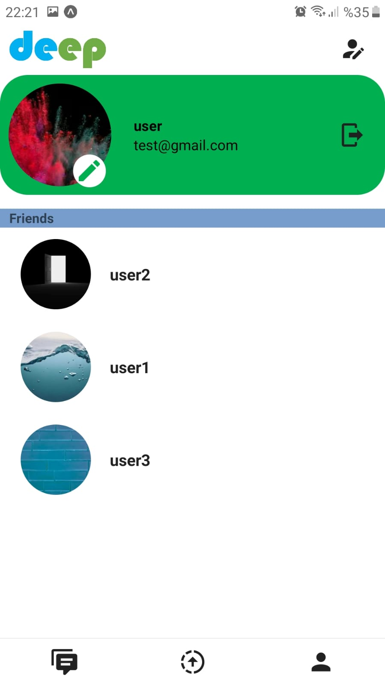

# FinalProject-Atakanz

# CHAT APP 

This project is executed for the final study of React Native Development Course held by Akbank and Patika.dev.

## ABOUT PROJECT
In this project, a chat app is designed using React Native Expo CLI. The navigation of the pages is provided with "React Navigation". The project makes use of firebase database services. Existing user information is saved in the phone's memory using async storage. When the app is restarted, the user is not presented with the login page thanks to Async storage. Redux saves the data that is used across all app pages, such as the user informations and theme. The expo location package is used to send the location. When a message is sent, an expo map is utilized to display the user's locations. Both choosing a photo from the phone and taking a picture are done using Expo Image picker package. 
## INSTALLATION

Clone the project and run the commands below respectively in the terminal.
```
https://github.com/patika-218-akbank-reactnative-bootcamp/FinalProject-Atakanz.git
```

```
cd ChatApp
```
```
expo start
```

# TECHNICALITIES

## FIRESTORE DATA STRUCTURE

The users collection includes documents that have user information. Email, statuses, friends list, and user name are the fields of these documents. 

The other collection is made up of all chat rooms that users have built.
By tapping the individual who was being searched, a new chat room document is saved and a friendship is automatically saved. To make it simple to find on the chat page, the user uids are combined to create the document id. These documents also have members and messages arrays. SenderId, date, and message type attributes are included in every message unit. Additionally, chat rooms have a field which displays when the page was last refreshed so that messages may be arranged by time. 

## APPLICATION DETAILS

A nested form of stack and bottom navigation is made at the beginning of the project. The user is first presented with the sign-in page and login form before moving on to the sign-up button. Users enter their email addresses, passwords, and unique usernames on the sign-up page. On this page, the supplied user name is checked to see if it exists. The user is requested to choose another particular one if the user name is not available. Following a successful registration, a new user document with the same ID as the user ID is added to the users collection. 

The sign-in screen prompted users to enter their email addresses and passwords. Following a successful sign-in, the user document in the users collection is retrieved and stored to redux. Here, using the onSnapShot way of fetching, updated firestore data is shown on all necessary pages at once, with user-initiated useEffect. 

After logging in, the web application moves to the bottom tab of the other conditional stack form. Friends' IDs are pulled from the redux and examined on the messages page to see whether any messages are present in the chat rooms associated with these IDs. The currently active chat rooms are located and then shown as flatlist items. On the default header bar of the message pages chat, there is an icon that links to the user search page. Here, only those users that were searched with fully usernames are displayed to the user. Friend request will be added in the next versions of the project.


On the chat pages, messages are shown with the onSnapShow way of fetching data so that last messages are shown in the page at once.


On the status pages, the friends which shared status in last 24 hours are listed. By tapping on the user cards, shared statuses can be seen as gallery. Also, users can share their first stasuses by tapping their user cards or add a new one by tapping header right plus icon.


On profile page, the current information, profile photo and friends list can be seen. The friends list is another way for users to access the chat sites. Users can access the page where they can modify their usernames, passwords, and emails by touching the icon in the top right corner of the header. In the edit profile page, users can also select a light or dark theme here by pressing the theme icon.



